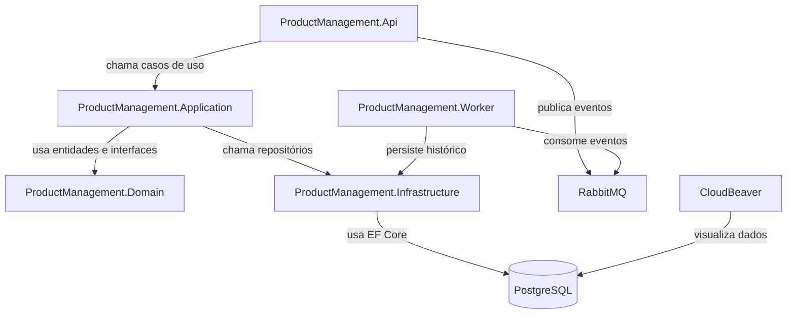
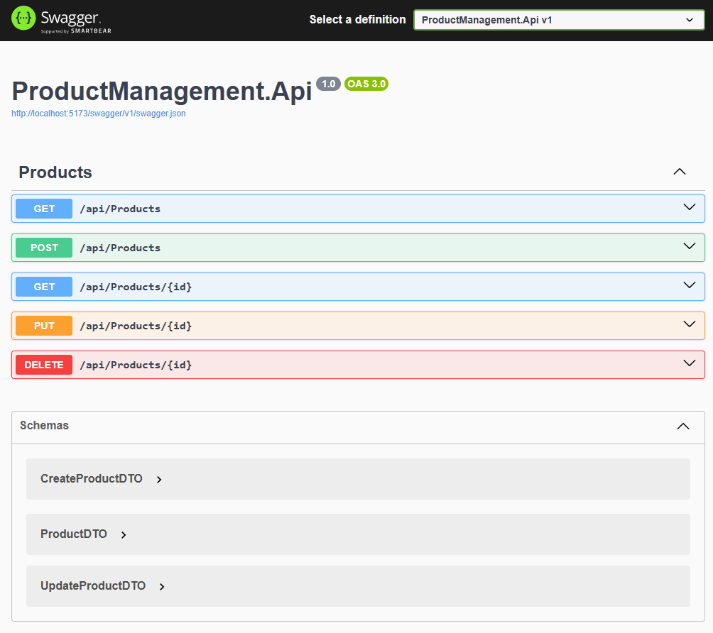

# 🏗️ ProductManagement  
### Clean Architecture • DDD • SOLID • .NET 8 • PostgreSQL • RabbitMQ • Docker


---

## 🚀 **Visão Geral**

**ProductManagement** é uma aplicação moderna em **.NET 8**, desenvolvida sob os princípios de **Clean Architecture** e **DDD (Domain-Driven Design)**, com foco em **escalabilidade**, **testabilidade** e **boas práticas**.

A aplicação realiza o **CRUD de produtos**, publica eventos no **RabbitMQ** e um **Worker Worker** processa esses eventos, registrando o histórico no **PostgreSQL**.

---

## 🧬 **Componentes Principais**

| Serviço | Função |
|----------|--------|
| **ProductManagement.Api** | API RESTful responsável pelo CRUD de produtos |
| **ProductManagement.Application** | Camada de Use Cases e regras de negócio (DDD Application Layer) |
| **ProductManagement.Domain** | Entidades, interfaces e regras de domínio puro |
| **ProductManagement.Infrastructure** | Persistência (EF Core), repositórios e integração com RabbitMQ (MassTransit) |
| **ProductManagement.Worker** | Worker (console app) que consome eventos do RabbitMQ e grava no banco |
| **PostgreSQL** | Banco de dados relacional |
| **RabbitMQ** | Mensageria (publica/consome eventos de produtos) |
| **CloudBeaver** | Interface web para visualizar o banco de dados |

---

## 🧠 **Arquitetura Clean (DDD)**



### 🬱 Princípios Aplicados
- **SOLID** → separação clara de responsabilidades  
- **DDD** → domínio isolado, com entidades e repositórios  
- **CQRS-like** → cada UseCase representa uma ação independente  
- **Dependency Inversion** → Application depende apenas de abstrações do Domain  
- **Testabilidade Total** → todas as camadas possuem testes unitários  

---

## ⚙️ **Infraestrutura (Docker Compose)**

📄 **docker-compose.yml**

```yaml
version: '3.9'

services:
  postgres:
    image: postgres:15-alpine
    container_name: postgres
    restart: always
    environment:
      POSTGRES_USER: dev
      POSTGRES_PASSWORD: devpassword
      POSTGRES_DB: appdb
    ports:
      - "5432:5432"
    volumes:
      - pgdata:/var/lib/postgresql/data

  rabbitmq:
    image: rabbitmq:3-management-alpine
    container_name: rabbitmq
    environment:
      RABBITMQ_DEFAULT_USER: admin
      RABBITMQ_DEFAULT_PASS: admin
    ports:
      - "5672:5672"
      - "15672:15672" # Painel Web

  cloudbeaver:
    image: dbeaver/cloudbeaver:latest
    container_name: cloudbeaver
    ports:
      - "8081:8978"
    depends_on:
      - postgres

  productmanagement.api:
    build:
      context: ./src
      dockerfile: ProductManagement.Api/Dockerfile
    container_name: productmanagement-api
    environment:
      ASPNETCORE_ENVIRONMENT: Development
      ConnectionStrings__DefaultConnection: "Host=postgres;Port=5432;Database=appdb;Username=dev;Password=devpassword;"
      RabbitMq__HostName: "rabbitmq"
      RabbitMq__UserName: "admin"
      RabbitMq__Password: "admin"
    depends_on:
      - postgres
      - rabbitmq
    ports:
      - "8080:8080"

  productmanagement.worker:
    build:
      context: ./src
      dockerfile: ProductManagement.Worker/Dockerfile
    container_name: productmanagement-worker
    environment:
      ConnectionStrings__DefaultConnection: "Host=postgres;Port=5432;Database=appdb;Username=dev;Password=devpassword;"
      RabbitMq__HostName: "rabbitmq"
      RabbitMq__UserName: "admin"
      RabbitMq__Password: "admin"
    depends_on:
      - rabbitmq
      - postgres

volumes:
  pgdata:
```

---

## ⚡ **Quickstart**

### 🛣️ Subir toda a stack

```bash
docker compose up --build -d
```

### 🔎 Acessos

| Serviço | URL | Usuário / Senha |
|----------|-----|-----------------|
| API (Swagger) | [http://localhost:8080/swagger](http://localhost:8080/swagger) | — |
| RabbitMQ | [http://localhost:15672](http://localhost:15672) | admin / admin |
| CloudBeaver | [http://localhost:8081](http://localhost:8081) | — |
| PostgreSQL | `localhost:5432` | dev / devpassword |

---

## 🧬 **Fluxo de Dados**

```
┌─────────────┐       ┌────────┐        ┌────────────┐
│   API (.NET) │─────▶│  RabbitMQ  │────▶│   Worker     │
│ (Publica)    │       │ (Mensageria)│       │ (Processa)    │
└─────────────┘       └────────┘        │  ProductEvents│
                                              └─────┬─────┘
                                                     │
                                                ┌────▼─────┐
                                                │ PostgreSQL│
                                                │ (Histórico)│
                                                └────────┘
```

---

## 🧪 **Testes**

O projeto cobre **todas as camadas** com testes unitários e de integração.

### ✅ Tecnologias
- [xUnit](https://xunit.net)
- [Moq](https://github.com/moq/moq4)
- [FluentAssertions](https://fluentassertions.com)
- [EFCore.InMemory](https://learn.microsoft.com/en-us/ef/core/testing/in-memory)
- [MassTransit.Testing](https://masstransit-project.com)

### 🔍 Rodar todos os testes
```bash
dotnet test --collect:"XPlat Code Coverage"
```

### 🖊️ Gerar relatório HTML
```bash
dotnet tool install -g dotnet-reportgenerator-globaltool
reportgenerator -reports:**/coverage.cobertura.xml -targetdir:coveragereport
start coveragereport/index.html
```

---

## 🧠 **Padrões e Boas Práticas**

| Categoria | Padrão Aplicado |
|------------|----------------|
| Arquitetura | Clean Architecture / Onion Architecture |
| Domínio | DDD (Entidades, Repositórios, Agregados) |
| Comunicação | MassTransit + RabbitMQ |
| Persistência | Entity Framework Core (PostgreSQL) |
| Testes | Unitários + Integração com InMemory DB |
| Containerização | Docker / Compose |
| Boas práticas | SOLID, CQRS, Dependency Injection |
| Migrations | Automatizadas (`db.Database.Migrate()`) |

---

## 🧰 **Estrutura do Projeto**

```
ProductManagement/
│
├── src/
│   ├── ProductManagement.Api/            # API REST
│   ├── ProductManagement.Application/    # Casos de Uso, DTOs e Lógica
│   ├── ProductManagement.Domain/         # Entidades e Regras de Domínio
│   ├── ProductManagement.Infrastructure/ # Repositórios e Mensageria
│   └── ProductManagement.Worker/       # Worker (MassTransit)
│
└── tests/
    ├── ProductManagement.Domain.Tests/
    ├── ProductManagement.Application.Tests/
    ├── ProductManagement.Infrastructure.Tests/
    ├── ProductManagement.Api.Tests/
    └─ ProductManagement.Worker.Tests/
```

---

## 🧠 Por que utilizar UseCases?

Os **Use Cases** (Casos de Uso) são uma peça fundamental na **Clean Architecture**. Eles representam a **regra de negócio** central da aplicação — aquilo que o sistema realmente precisa fazer, independentemente de frameworks, bancos ou interfaces.

### Benefícios dos Use Cases:

- **Separação clara de responsabilidades:** o domínio da aplicação não depende da infraestrutura.
- **Facilidade de teste:** como são classes simples, sem dependência direta de banco, é possível testar cada fluxo isoladamente com mocks.
- **Evolução segura:** mudar o banco (ex: Postgres → Mongo) ou a UI (Angular → React) não afeta a lógica de negócio.
- **Reuso:** a mesma regra de negócio pode ser exposta via REST, gRPC ou filas sem duplicar código.
- **Legibilidade:** cada caso de uso expressa exatamente o que o sistema faz — `CreateProductUseCase`, `DeleteProductUseCase`, etc.

Em resumo, os *Use Cases* encapsulam o comportamento essencial da aplicação, garantindo **coesão**, **baixo acoplamento** e **flexibilidade de manutenção**.

---

## 🔧 **Build Manual**

Se quiser compilar e rodar localmente (sem Docker):

```bash
dotnet restore
dotnet build
dotnet run --project src/ProductManagement.Api
```

E para o worker:

```bash
dotnet run --project src/ProductManagement.Worker
```

---

## **🌐 Endpoints**

Base URL (local): http://localhost:5000



---

## 📦 **Migrations**

### Criar migration:
```bash
dotnet ef migrations add InitialCreate -p src/ProductManagement.Infrastructure -s src/ProductManagement.Api -o Persistence/Migrations
```

### Aplicar migration:
```bash
dotnet ef database update -p src/ProductManagement.Infrastructure -s src/ProductManagement.Api
```

---

## 🤰 **Tecnologias**

| Categoria | Stack |
|------------|-------|
| Backend | .NET 8 / C# 12 |
| ORM | Entity Framework Core |
| Database | PostgreSQL |
| Mensageria | RabbitMQ (via MassTransit) |
| Testes | xUnit + Moq + FluentAssertions |
| Containers | Docker + Docker Compose |
| DevTools | CloudBeaver, Swagger, RabbitMQ UI |

---

## 📄 **Licença**

Este projeto é distribuído sob a licença **MIT** — veja o arquivo [LICENSE](LICENSE) para mais detalhes.

---

## 👨‍💻 Autor

**Avilander Cunha**  
💼 Software Engineer | 🧠 Arquitetura Clean & DevOps  
📧 [contato profissional via GitHub](https://github.com/AvilanderCunha)

---

> 💡 *Este projeto serve como base sólida para aplicações .NET modernas com integração assíncrona, testes completos e infraestrutura containerizada pronta para produção.*